# CSC4303 Network Programming

## Reference

- [Reference](https://book.systemsapproach.org/foundation.html)

## Network Model

|Layer|Description|Example|
|:--:|:--:|:--:|
|Application|Programs that use network service|HTTP, DNS, CDNs|
|Transport|Provides end-to-end data delivery|TCP, UDP|
|Network|Send packets over multiple networks|IP, NAT, BGP|
|Link|Send frames over one or more links|Ethernet, 802.11|
|Physical|Send bits using signals|wires, fiber, wireless|

### Transport Layer

#### User Datagram Protocol (UDP)

- **Connectionless** 
    
    Each packet is independent.

    ```
    Sender    Time       Receiver
      |                     |
      |----- Packet1 -----> |
      |                     |
      |----- Packet2 -----> |
      |                     |
    ```

- **Buffering**

    UDP buffering is a "temporary storage area" maintained by the operating system for each UDP port, where arriving packets queue up when applications can't process them immediately.

    ```
    Application A  Application B   Application C
        ↓               ↓               ↓
    [Port X]        [Port Y]        [Port Z]      ← Port mapping
        ↓               ↓               ↓
    [Queue 1]       [Queue 2]       [Queue 3]     ← Independent UDP message queues
        │               │               │
        └───────┬───────┴───────┬───────┘
                ↓               ↓
        [Port Multiplexer/Demultiplexer]          ← Routes by port number
                ↓
        [Incoming UDP packets]
    ```

- **Header**

    Note that the Datagram length up to 64K.
    ```
         32-bit width (4 bytes per row)
    0                  16                31
    ┌──────────────────┬──────────────────┐
    │ Source Port      │ Destination Port │ ← Port addressing
    │   (16 bits)      │   (16 bits)      │
    ├──────────────────┴──────────────────┤
    │    Length        │    Checksum      │ ← Size & integrity
    │    (16 bits)     │    (16 bits)     │
    ├─────────────────────────────────────┤
    │                                     │
    │           Application Data          │
    │                                     │
    └─────────────────────────────────────┘
    ```
    
#### Transmission Control Protocol (TCP)

- **Header**

    ```
    0                   1                   2                   3
    0 1 2 3 4 5 6 7 8 9 0 1 2 3 4 5 6 7 8 9 0 1 2 3 4 5 6 7 8 9 0 1
    +-+-+-+-+-+-+-+-+-+-+-+-+-+-+-+-+-+-+-+-+-+-+-+-+-+-+-+-+-+-+-+-+
    |          Source Port          |       Destination Port        | ← Identifies sockets
    +-+-+-+-+-+-+-+-+-+-+-+-+-+-+-+-+-+-+-+-+-+-+-+-+-+-+-+-+-+-+-+-+
    |                        Sequence Number (32)                   | ← Byte-based sequencing
    +-+-+-+-+-+-+-+-+-+-+-+-+-+-+-+-+-+-+-+-+-+-+-+-+-+-+-+-+-+-+-+-+
    |                    Acknowledgment Number (32)                 | ← Next expected byte
    +-+-+-+-+-+-+-+-+-+-+-+-+-+-+-+-+-+-+-+-+-+-+-+-+-+-+-+-+-+-+-+-+
    |  Data Offset  |  0  |  Flags  |       Window Size (16)        | ← Control & flow control
    +-+-+-+-+-+-+-+-+-+-+-+-+-+-+-+-+-+-+-+-+-+-+-+-+-+-+-+-+-+-+-+-+
    |     Checksum (16)             |       Urgent Pointer (16)     | ← Integrity & urgent data
    +-+-+-+-+-+-+-+-+-+-+-+-+-+-+-+-+-+-+-+-+-+-+-+-+-+-+-+-+-+-+-+-+
    |                         Options (variable)                    |
    +-+-+-+-+-+-+-+-+-+-+-+-+-+-+-+-+-+-+-+-+-+-+-+-+-+-+-+-+-+-+-+-+
    |                           Data                                |
    +-+-+-+-+-+-+-+-+-+-+-+-+-+-+-+-+-+-+-+-+-+-+-+-+-+-+-+-+-+-+-+-+
    ```

    - **Connection Establishment (Setup)**

        - **Three-Way Handshake**

            Both parties send Initial Sequence Numbers (ISNs) via SYNchronize segments. Each party acknowledges the other's sequence number using ACKnowledge segments.

            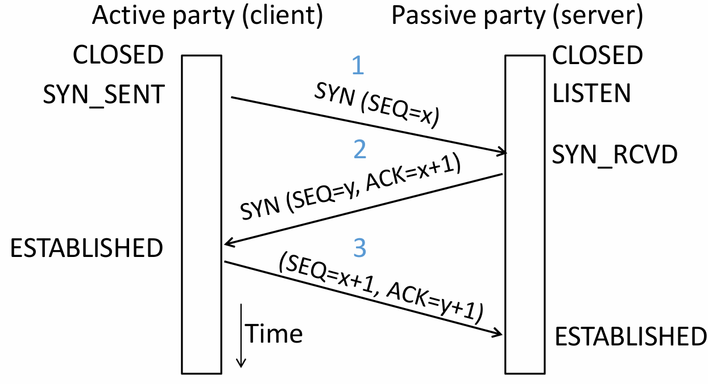

            |Step|Initiator (Client)| Receiver (Server)|Description|
            |:--:|:--:|:--:|:--:|
            |First Handshake | Sends $\texttt{SYN}=1, \texttt{seq}=x$ | Waits for connection request | Client requests to establish a connection and sends its ISN $x$.|
            |Second Handshake | Waits for acknowledgment | Sends $\texttt{SYN}=1, \texttt{ACK}=1, \texttt{seq}=y, \texttt{ack}=x+1$ <br> It acknowledges receipt through sequence number $x$. | Server agrees to connect, sends its own ISN $y$, and acknowledges the receipt of $x$.|
            |Third Handshake | Sends $\texttt{ACK}=1, \texttt{seq}=x+1, \texttt{ack}=y+1$ | Connection established| Client acknowledges the receipt of $y$, and the connection is formally established.|

            Three-way handshake prevents a server from wasting resources on stale or duplicate connection requests by requiring the client's final acknowledgment.

        - **State Machine**

            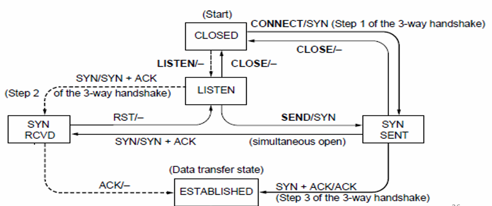

            - Client Path `CLOSED → connect() → SYN_SENT → Receive SYN+ACK → ESTABLISHED`

            - Server Path `CLOSED → listen() → LISTEN → Receive SYN → SYN_RCVD → Receive ACK → ESTABLISHED`

            - Both parties run instances of this state machine, and TCP allows for simultaneous open.

    - **Connection Release (Teardown)**

        - **Four-Way Handshake (symmetric)**

            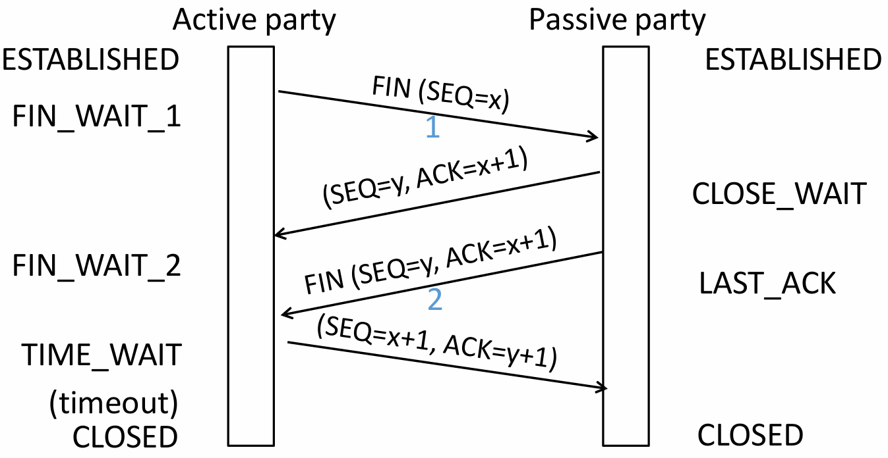

            | Step | Initiator (Active Closer) | Receiver (Passive Closer) | Description |
            |:---:|:---:|:---:|:---:|
            | First Wave | Sends $\texttt{FIN}=1, \texttt{seq}=u$ | Waits for close request | Initiator has finished sending data and requests to close its sending channel. |
            | Second Wave | Waits for remaining data | Sends $\texttt{ACK}=1, \texttt{ack}=u+1$ | Receiver acknowledges the close request **but may still have data to send**. |
            | Third Wave | Waits for confirmation | Sends $\texttt{FIN}=1, \texttt{seq}=v$ | Receiver has finished sending data and requests to close its sending channel. |
            | Fourth Wave | Sends $\texttt{ACK}=1, \texttt{ack}=v+1$ | Connection closed | Initiator acknowledges the close request. |
        
        - **State Machine**

            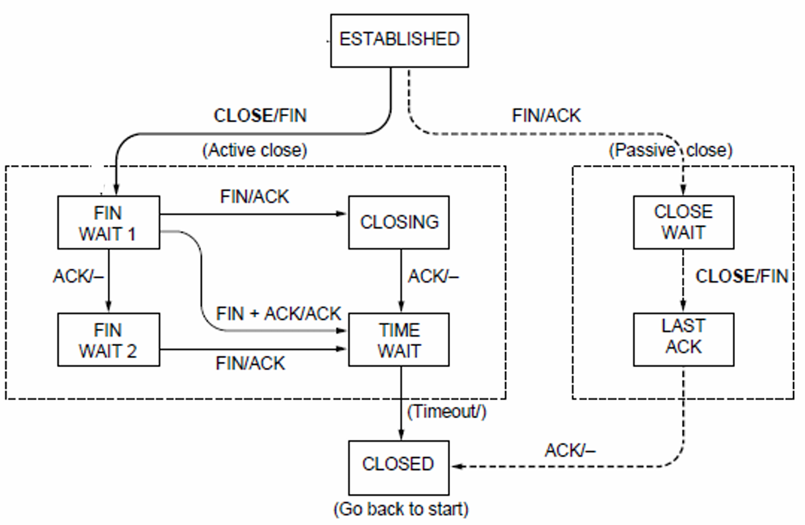

            - **Active Closer Path** `ESTABLISHED → close() → FIN_WAIT_1 → Receive ACK → FIN_WAIT_2 → Receive FIN → TIME_WAIT → Timeout → CLOSED`

            - **Passive Closer Path** `ESTABLISHED → Receive FIN → CLOSE_WAIT → close() → LAST_ACK → Receive ACK → CLOSED`

            - **TIME_WAIT State**

                - $2 \times \texttt{MSL}$ (Maximum Segment Lifetime).

                - Lost ACKs can be recovered.

                - Old segments won't confuse new connections.
                
    - **Flow Control** (Receiver processing limitation)

        - **Automatic Repeat Query**
            
            ARQ with one message at a time is **Stop-and-Wait**. It allows only a single message to be outstanding from sender.

        - **Sliding Window**

           It allows $W$ outstanding packets, enabling pipelining to send multiple packets per RTT for improved performance.

           Sender buffers up to $W$ segments until they are acknowledged. The last frame sent minus last ack rec'd should no more than $W$.

           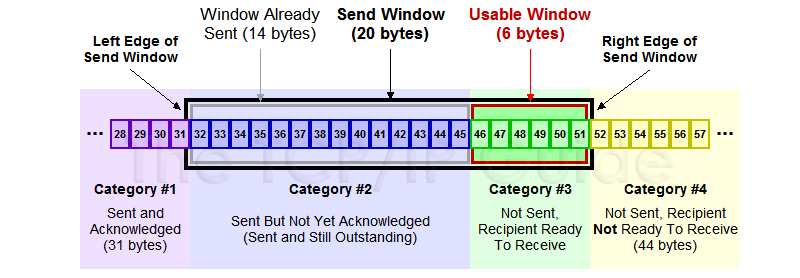

            - **Go-Back-N**

                Only buffers next expected packet (LAS). Accepts only sequential packets, discards others, sends **cumulative** ACK.

            - **Selective Repeat**

                Buffers entire window. Stores out-of-order packets, sends individual ACKs, retransmits only lost packets.
            
            - **Sequence Number**

                $n$ bit counter wraps around at $2^n - 1$. Let $\text{LAR}$ be Last Acknowledgement Received, $\text{LAS}$ be Last Acknowledgement Sent.
                |Method|Sender's Range|Receiver's Range|Min Number Needed to Avoid Overlap|
                |:--:|:--:|:--:|:--:|
                |Go-Back-N|$[\text{LAR} + 1,\text{LAR} + W]$|$\text{LAS} + 1$|$W + 1$|
                |Selective Repeat|$[\text{LAR} + 1,\text{LAR} + W]$|$[\text{LAS} + 1,\text{LAS} + W]$|$2W$|
        
        - **Pacing**

            - **ACK Clocking** (sender)

                ACK clocking is a feedback mechanism where the network itself determines the sending pace, preventing queue buildup and ensuring efficient, low-latency data flow.

            - **Flow Control** (Receiver)

                Flow control uses the `WIN` field, calculated as `WIN = ReceiveBuffer - (LastByteRcvd - LastByteRead)`, to dynamically limit the sender's window, preventing receiver buffer overflow.

            $\text{SEQ} + \text{length} < \text{ACK} + \text{WIN}$

            - **Adaptive Timeout**

                |Name|Formula|
                |:--:|:--:|
                |$\text{SRTT}$ (average round‑trip time)|$\text{SRTT}_{n + 1} = (1 - \alpha)\cdot \text{SRTT}_n + \alpha \cdot \text{RTT}_{n + 1}$ |
                |$\text{Svar}$ (variability of RTT)|$\text{Svar}_{n + 1} = (1-\beta)\cdot \text{Svar}_n + \beta \cdot \mid \text{RTT}_{n + 1} - \text{SRTT}_{n + 1} \mid$|
                |$\text{Timeout}$|$\text{Timeout}_n = \text{SRTT}_n + 4 \cdot \text{Svar}_n$|
        
    - **Congestion Control** (Network capacity limitation)
        TCP congestion control uses a sliding window (cwnd), interprets packet loss as a congestion signal, and adjusts the window via AIMD to achieve an efficient and roughly fair bandwidth allocation.

        - **Max-Min fairness**

            Increse the rate of one flow will decrease the rate of a smaller flow.

            > Step 1 Initialize all flows at zero  
            Step 2 Increase all flows equally  
            Step 3 Freeze bottlenecked flows  
            Step 4 Repeat for remaining flows

        - **Bandwidth allocation**

            Network layer provides direct feedback & Transport layer reduces load [Network is distributed, no single party has an overall picture of its state.]

            - **Models**
                - Open loop [reserve] & Closed loop [use feedback to adjust rates]

                - Host support & Network support

                - Window based & Rate based

                **TCP is a closed loop,host-driven, and window-based**

            - **AIMD(Additive Increase Multiplicative Decrease)** 

                - Hosts additively increase rate while network not congested

                - Hosts multiplicatively decrease rate when congested

        - **TCP Tahoe/Reno**

            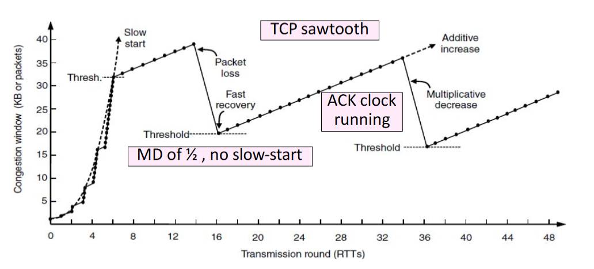

            - **Slow Start**
                
               For each ACK received: $\text{cwnd} = \text{cwnd} + 1$, $\text{cwnd}$ doubles every RTT.
            
            - **Later Additive Increase (AI)**

                For each ACK received: $\text{cwnd} \leftarrow \text{cwnd} + \frac{1}{\text{cwnd}}$, roughly adds 1 packet per RTT.

            - **Switching Threshold (Initially Infinity)**

                Switch to AI when When $\text{cwnd} > \text{ssthresh}$, and $\text{ssthresh} = \frac{\text{cwnd}}{2}$ after loss. **Begin with slow start after timeout ($\text{cwnd} = 1$).**
            
            - **Fast Retransmit**

                TCP's cumulative ACKs allow duplicate ACKs to signal lost packets for fast retransmission.(Treat three duplicate ACKs as a loss.)
            
            - **Fast Recovery (TCP Reno)**

                Fast recovery keeps data flowing during retransmission by maintaining the ACK clock. It avoids resetting to Slow Start after packet loss. Set $\text{ssthresh} = \frac{\text{cwnd}}{2}$ and then continue AI directly.

#### UDP & TCP

|Feature|TCP|UDP|
|:--:|:--:|:--:|
|Mode|Connections|Datagrams|
|Reliability|No loss, no duplicates, in-order delivery|May lose, reorder, or duplicate packets|
|Data Size|Unlimited|Limited|
|Flow Control|Flow control matches sender to receiver|Send regardless of receiver state|
|Congestion Control|Congestion control matches sender to network|Send regardless of network state|
|Example|Files, Web pages|Voice, video, DNS|
        
#### Socket
    
An endpoint for network communication that allows an application to attach to a specific port on the local network interface, enabling data exchange with other applications across the network.

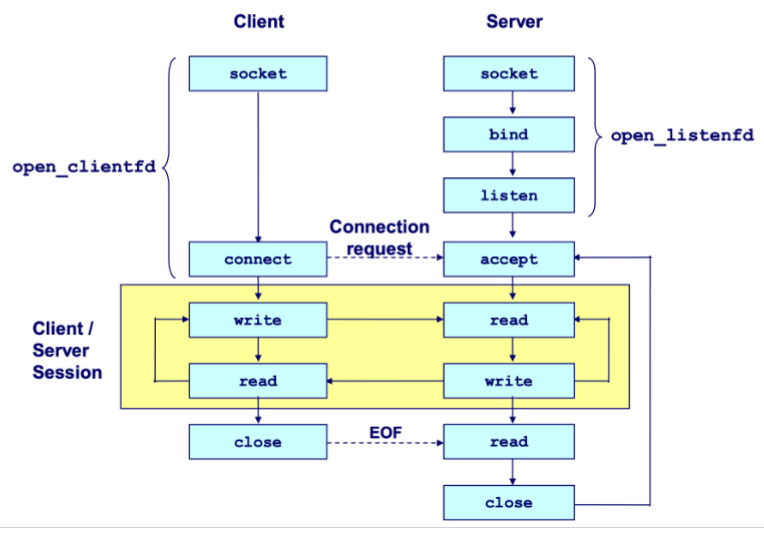

- **Process**

    Cilent `socket () ------------------------> connect () -> I/O -> close ()`

    Server `socket () -> bind () -> listen () -> accept () -> I/O -> close ()`

    1. The server blocks in `accept()` on `listenfd` for incoming connections. 

    2. The client calls `connect()` to initiate the TCP handshake, which also blocks. 

    3. Upon completion, the server's `accept()` returns a `connfd` and the client's `connect()` returns, establishing a bidirectional channel between `clientfd` and `connfd`.

- **Create** `int socket (int domain, int type, int protocol);` 
    
    - **domain** AF_INET IPv4 / AF_INET6 IPv6.

    - **type** SOCK_STREAM TCP / SOCK_DGRAM UDP.

    - **protocol** 0 (automatically select the default protocol).

- **Bind** `int bind (int sockfd, sockaddr *addr, socklen_t addrlen);`
    
    When a **server** binds a socket to a specific address, it establishes that data arriving at that address is read from this socket, and data written to this socket is sent from that address.

    - **socket address**

        ```c
        struct sockaddr
        {
            uint_16 ss_family; // protocol family
            char ss_data[14]; // address data
        }
        ```

    - **sockaddr_in**

        ```c
        struct sockaddr_in
        {
            uint16_t sin_family; // always AF_INET
            uint16_t sin_port; // in network byte order
            struct in_addr sin_addr; // in network byte order
            unsigned char sin_zero[8]; // pad to sizeof (struct sockaddr), placeholder
        }
        ```

        Network data is transmitted in big-endian byte order. Use `htons()` and `htonl()` to convert host-ordered values into network-ordered short and long integers, respectively.
    
- **Listen** `int listen (int sockfd, int backlog);`

    `listen ()` transforms a socket descriptor into a listening socket capable of accepting client connections. The `backlog` parameter suggests how many pending connections the kernel may queue before refusing new requests (typically around 128).

- **Accept** `int accpet (int listenfd, sockaddr *addr, int *addrlen);`
    
    `accept()` blocks until a client connects via `listenfd`, stores the client's address in `addr`, and returns a `connfd` for communication using standard Unix I/O functions.

- **Connect** `int connect (int clientfd, sockaddr *addr, socklen_t addrlen);`

    Attempts to establish a connection with server at socket address `addr`.

    To convert a string-formatted IP address (e.g., `SERVER_IP`), use `inet_pton (int af, const char *src, void *dst)` to transform it into binary network format.

    |Feature|`listenfd`|`connfd`|
    |:--:|:--:|:--:|
    |**Purpose**|Accepts connection requests|Handles data exchange with a client|
    |**Creation**|Once at server start|Per accepted connection|
    |**Lifetime**|Entire server runtime|Duration of client service|
    |**Quantity**|One per port|One per active client|
    |**Concurrent Use**|Listens for all clients|Dedicated to single client|

- **Send and Receive**

    `ssize_t read (int fd, void *buf, size_t len);` returns the number of bytes actually read (0 indicates the connection is closed, -1 indicates an error).

    `ssize_t write (int fa, const void *buf, size_t len);` returns the number of bytes actually written (-1 indicates an error).

- **Close** `int close (int sockfd)`

- **Concurrency**

    - **Threading/Process** Race conditions increase complexity!
    
    - **I/O Multiplexing** 
        
        - `select()`

        - `poll()` 
            
            `poll()` is a system call used to monitor multiple file descriptors concurrently for I/O readiness. Unlike `select()`, it imposes **no fixed limit** on the number of file descriptors that can be monitored.

            ```c
            struct pollfd
            {
                int fd; // file descriptor
                short events; // requested events
                short revents; // returned events
            }   
            ```

### Network Layer

#### Internet Protocol (IP)

- **IPV4 Header**

```
0                   1                   2                   3
0 1 2 3 4 5 6 7 8 9 0 1 2 3 4 5 6 7 8 9 0 1 2 3 4 5 6 7 8 9 0 1
+-+-+-+-+-+-+-+-+-+-+-+-+-+-+-+-+-+-+-+-+-+-+-+-+-+-+-+-+-+-+-+-+
|Version| IHL   |Type of Service|        Total Length (16)      | ← Basic identification (IHL : Header)
+-+-+-+-+-+-+-+-+-+-+-+-+-+-+-+-+-+-+-+-+-+-+-+-+-+-+-+-+-+-+-+-+
|        Identification (16)    |Flags|   Fragment Offset (13)  | ← Fragmentation control
+-+-+-+-+-+-+-+-+-+-+-+-+-+-+-+-+-+-+-+-+-+-+-+-+-+-+-+-+-+-+-+-+
|  Time to Live |    Protocol   |        Header Checksum (16)   | ← Routing & integrity (Time to Live : TTL)
+-+-+-+-+-+-+-+-+-+-+-+-+-+-+-+-+-+-+-+-+-+-+-+-+-+-+-+-+-+-+-+-+
|                       Source Address (32)                     | ← Sender IP
+-+-+-+-+-+-+-+-+-+-+-+-+-+-+-+-+-+-+-+-+-+-+-+-+-+-+-+-+-+-+-+-+
|                    Destination Address (32)                   | ← Receiver IP
+-+-+-+-+-+-+-+-+-+-+-+-+-+-+-+-+-+-+-+-+-+-+-+-+-+-+-+-+-+-+-+-+
|                    Options (if any, variable)                 | ← Optional features
+-+-+-+-+-+-+-+-+-+-+-+-+-+-+-+-+-+-+-+-+-+-+-+-+-+-+-+-+-+-+-+-+
|                           Payload (Data)                      |
+-+-+-+-+-+-+-+-+-+-+-+-+-+-+-+-+-+-+-+-+-+-+-+-+-+-+-+-+-+-+-+-+
```

- **IP Addresses** An IP address is assigned to each network interface. Consequently, routers possess multiple interfaces, while most hosts have just one or two (wired and wireless).

- **IP Prefixes** In a prefix of length L, the top L bits are identical across all addresses. In CIDR notation, such a prefix is denoted as `IP address/prefix length` (e.g. `128.13.0.0/16` is `128.13.0.0` to `128.13.255.255`.)

- **IP Forwarding** It uses longest prefix matching to select the most specific route.

- **IP fragmentation**

    - **MTU** Max Transfer Size
    - **MSS** Maximum Segment Size
    
    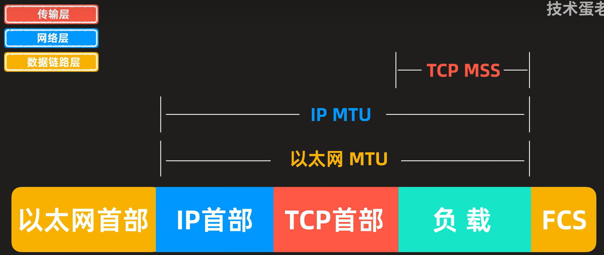

    Each fragment is encapsulated with its own IP header.

    | Field | Size (bits) | Purpose |
    |:--:|:--:|:--:|
    | **Identification** | 16 | Unique identifier for the original datagram; **all fragments** of the same datagram share this value. |
    | **Flags** | 3 | Control bits for fragmentation<br>**DF (Don't Fragment)** If set 1, routers must not fragment the packet.<br>**MF (More Fragments)** If set 1, more fragments follow, otherwise indicates that it is the last fragment. |
    | **Fragment Offset** | 13 | Indicates the position of this fragment's data **in 8‑byte units** relative to the start of the original datagram. |

#### Dynamic Host Configuration Protocol (DHCP) [Application Layer]

Uses UDP ports 67 (server) and 68 (client). 

| Step | Message | IP Header (Src &rarr; Dst) | Ethernet (Src &rarr; Dst) | Purpose |
|:----:|:--------|:-------------------------------------------|:--------------------------------------------------------|:---------------------------------------|
| 1 | **DISCOVER** | `0.0.0.0` &rarr; `255.255.255.255` | `Client MAC` &rarr; `FF:FF:FF:FF:FF:FF` | Client broadcasts to find DHCP servers |
| 2 | **OFFER** | `Server's IP` &rarr; `255.255.255.255` | `Server MAC` &rarr; `Client MAC`| Server proposes IP configuration |
| 3 | **REQUEST** | `0.0.0.0` &rarr; `255.255.255.255` | `Client MAC` &rarr; `FF:FF:FF:FF:FF:FF` | Client accepts the offer |
| 4 | **ACK** | `Server's IP` &rarr; `255.255.255.255` | `Server MAC` &rarr; ` Client MAC` | Server confirms and finalizes lease |

#### Address Resolution Protocol (ARP)

Every network device possesses a unique MAC (Media Access Control) address, which operates at the link layer.

ARP resolves IP to MAC addresses locally. A node **broadcasts** an ARP request, receives a **private** reply, and **caches** the mapping in its ARP table.

#### Internet Control Message Protocol (ICMP)

When an error occurs, an ICMP error report is sent back to the source IP address and the problematic packet is discarded. The source host must then rectify the issue.

- **Message Format**

    - **IP Header** `Src = router, Dst = A, Protocol = 1`

    - **ICMP Header** `Type = X, Code = Y`

    - **ICMP Data** `Src = A, Dst = B, ...`
  
- **Type**

|Name|Code|Usage|
|:--:|:--:|:--:|
|Dest. Unreachable (Net or Host)|`3/0` or `3/1`|Lack of connectivity|
|Dest. Unreachable (Fragment)|`3/4`|Path MTU Discovery|
|Time Exceeded (Transit) |`11/0`|Traceroute ($\texttt{TTL} = 0$)|
|Echo Request or Reply|`8/0` or `0/0`|Ping|

- **Traceroute**

Traceroute sends probe packets with incrementing TTL. Each router that decrements TTL to zero replies with an ICMP Time Exceeded error, revealing its address.

#### Network Address Translation (NAT)

NAT maps multiple private IP:port pairs to a single public IP with unique external ports via a stateful translation table, enabling many internal devices to share one external address.

#### Routing and Forwarding

- **Fully Distributed Routing**
  
    - **No central controller** All routers are equal and make independent decisions.  
    - **Local knowledge only** Routers learn about the network by exchanging messages with directly connected neighbors.
    - **Concurrent operation**
    - **Failure tolerance** There may be node/link/message failures.

- **Hierarchical Routing**

    Introduce a larger routing unit. Route first to the region, then to the IP prefix within the region.

    - **Routing Table**

        - **Static Routing**
        - **Dynamic Routing** RIP (Routing Information Protocol), OSPF (Open Shortest Path First), BGP (Border Gateway Protocol).

    - **IP Prefix Aggregation and Subnets** (Longest prefix matching)

        Routers can change prefix lengths without affecting hosts.

        - **Subnetting** Split large prefix into smaller ones internally.
        - **Aggregation** Join small prefixes into one large prefix externally.
    
#### Routing

- **Sink Tree** 

    Sink tree for a destination is the union of all shortest paths towards the destination. Each node only stores next hop (parent) towards root.

- **Distance Vector Routing**

    Each node shares distance vectors with neighbors, updates paths using shortest heard distance, and forwards via best next hop.

    Slow convergence, count-to-infinity, and routing loops occur because nodes only know neighbor info, not full topology, causing outdated routes to propagate and persist.

    - **RIP (Routing Information Protocol)**

- **Link-State Routing**

    - **Flooding**
        - Send an incoming message on to all other neigbors.
        - Remember the message so that it is only flooded once.
    - **Dijkstra**

### Application Layer 

#### Peer to Peer

Leverage peer resources: computation, storage, bandwidth. Also emerging: mobility, coins (tokens), sensors. Decentralized, scalable architecture.

Storage networks replicate files anywhere, making search difficult, especially with node churn.

- **Framework**  

    - **Join** How to start participating
    - **Publish** How to advertise files
    - **Search** How to find files
    - **Fetch** How to retrieve files

- **Napster**

    Server does all porcessing & Server maintains $O(N)$ state & Single point of failure
    
    - **Join** Client contacts central server on startup
    - **Publish** Reports list of files to central server
    - **Search** Query server → returns peer storing requested file
    - **Fetch** Get file directly from peer

- **Gnutella**

    Complete decentralization & Query flooding

    Search scope is $O(N)$ & Unpredictable search time & No guarantee of finding files (TTL-limited search only works well for haystacks)

    - **Join** Client contacts a few existing nodes on startup → these become its "neighbors"
    - **Publish** No need (no central index)
    - **Search** Ask neighbors → neighbors ask their neighbors → when/if found, reply back along the path; TTL limits propagation
    - **Fetch** Get file directly from peer

- **Gnutella/KaZaA [Two-level hierarchy]**

    Kept a centralized registration

    Supernodes have better connection to Internet and act as temporary indexing servers for other nodes to help improve the stability fo the network.

    Standard nodes connect to supernodes and report list od files.

| Dimension | Napster | Gnutella | Gnutella/KaZaA (Two-Layer) |
|-----------|-------------|---------------------|--------------------------------|
| **Index** | Central server | No index | Supernodes maintain index (temporary central) |
| **Search** | Query central server | Flooding (ask neighbors) | Flooding between supernodes |
| **Transfer** | Direct peer-to-peer | Direct peer-to-peer | Direct peer-to-peer |
| **Join** | Contact central server | Find a few neighbors | Find and connect to a supernode |

- **BitTorrent**

    Central tracker server needed to bootstrap swarm.

    - **File swarming** Files split into chunks; download from multiple peers, upload to others simultaneously.
    - **Tracker** Central server coordinates peers (joins, maintains lists), but doesn't store files.
    - **Tit-for-tat** Upload to the fastest $N$ peers you download from. Encourages fairness, discourages freeloading.
    - **Optimistic unchoke** Randomly let new peers download to prevents starvation, discovers better partners.
    - **Rarest first** Prioritize distributing scarce chunks to improve file availability and resilience.
    - **Out-of-band search** Find files via Google/torrent sites. Scalable, no single point of failure.
  
- **DHT (Distributed Hash Table)**
    
    Decentralized system using consistent hashing: keys and nodes hashed onto a ring (Chord). Each key stored on its successor node. Finger tables enable $O(\log N)$ lookup (Entry $i$ which starts from $1$ points to the first node on the ring that is $\ge x + 2^{i - 1}$), improving from naive $O(N)$.

#### Amazon Dynamo

- **Architecture**

    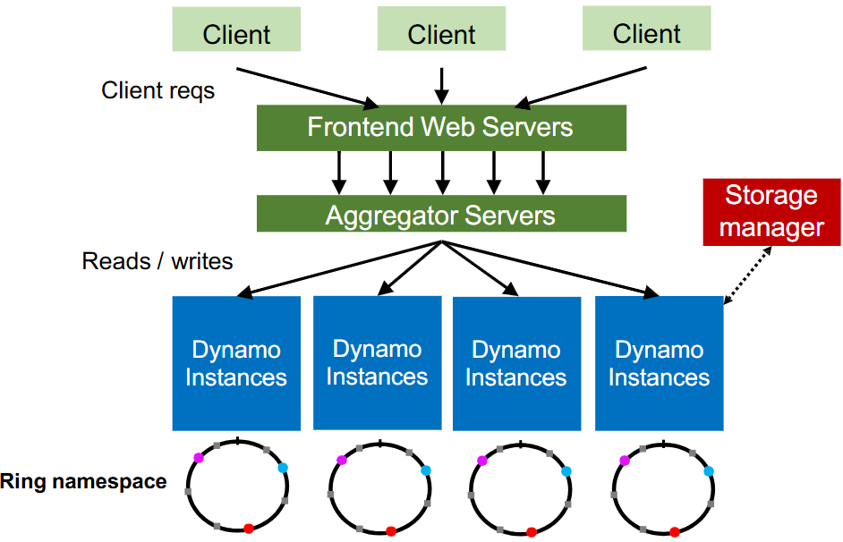

- **Partition**
  
    - **Hash partitioning** `partition = hash(key) % partition_count`
    - **Consistent hashing** (better) 
    - **Virtual nodes (vnodes)** Virtual nodes assign multiple ring positions to each physical node, distributing data migration and improving load balancing across all nodes.
    - **Heterogeneity** More powerful nodes can have more capacity, thus more vnodes.
    - **Replication** Dynamo skips nodes to ensure replicas reside on different nodes (set Replication Factor, i.e. $RF$).
    - **Dynamo Reads/Writes** $R/W$ is configurable. When $R + W > RF$, the  read and written will overlap, with last write wins (LWW) resolving conflicts.
    - **Dynamo API**

        -  `get (k)` returns value(s) and context. It returns multiple versions if conflicts exist. The context contains Timestamps to track version history.
        - `put (k,context,value)` uses the provided context to indicate which previous version(s) this new version supersedes or merges.

#### HyperText Transfer Protocol (HTTP)

- **Request**

|Method|Description|
|:--:|:--:|
|$\text{GET}$|Read a Web page|
|$\text{HEAD}$|Read a Web page's header|
|$\text{POST}$|Append to a Web page|
|$\text{PUT}$|Store a Web page|
|$\text{DELETE}$|Remove the Web page|
|$\text{TRACE}$|Echo the incoming request|
|$\text{CONNECT}$|Connect through a proxy|
|$\text{OPTIONS}$|Query options for a page|

- **Response**

|Meaning|Example|
|:--:|:--:|
| **Information** | $\texttt{100}$ Server agrees to handle client's request <br> $\texttt{101}$ Switching protocols |
| **Success**     | $\texttt{200}$ Request succeeded <br> $\texttt{201}$ New resource created <br> $\texttt{204}$ No content present |
| **Redirection** | $\texttt{301}$ Page moved permanently <br> $\texttt{302}$ Temporary redirect <br> $\texttt{304}$ Cached page still valid |
| **Client error**| $\texttt{400}$ Bad request <br> $\texttt{401}$ Authentication required <br> $\texttt{403}$ Forbidden page <br> $\texttt{404}$ Page not found <br> $\texttt{429}$ Too many requests |
| **Server error**| $\texttt{500}$ Internal server error <br> $\texttt{502}$ Bad gateway <br> $\texttt{503}$ Service unavailable, try again later <br> $\texttt{504}$ Gateway timeout |

- **Page Load Time (PLT)** 
    
    PLT measures web performance from click to page visible, influenced by page structure, HTTP/TCP protocols, and network RTT/bandwidth.

    HTTP/1.0 used one TCP connection per web resource.
    
    - **Parallel Connections** Browser runs multiple parallel HTTP instances, pulls in completion time of last fetch.

    - **Persistent Connections** Parallel connections compete with each other for network resources. Make one TCP connection to one server and use it multiple HTTP requests.

- **Web Caching and Proxies**

    - **Cached Content**

        - **Locally** expiry information (expires header) & heuristics (cacheable, fresh, not modified recently) [Content is then available right away]
        - **Server** Last-Modified header & ETag” header [Content is available after 1 RTT (if connection open)]

    - **Web Proxies** Place intermediary between clients and server.

#### Domain Name System (DNS)

DNS is a naming service to map between host names and their IP addresses (Distributed directory based on a hierarchical namespace and automated protocol to tie pieces together).

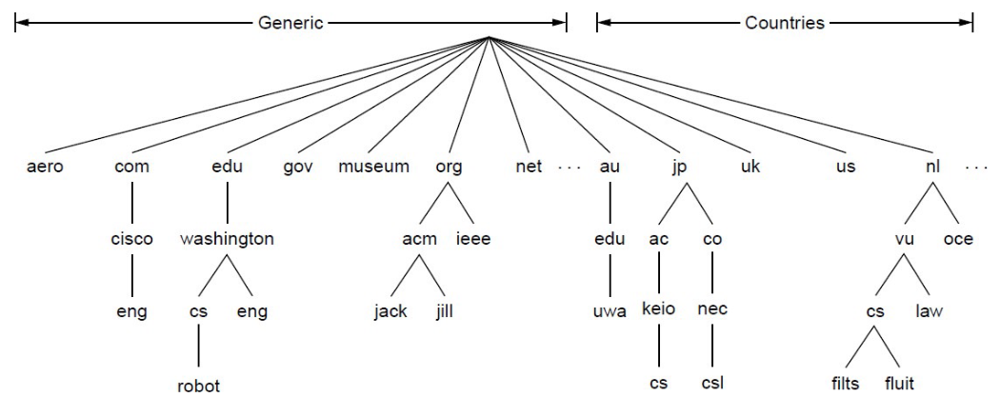

- **Top-Level Domains (TLDS)**

- **DNS Resolution** Start with the root nameserver and work down zones.

- **Local Nameservers and Root Nameservers** 
    
    Local nameservers handle client queries and recursion, while root nameservers direct them to the appropriate top-level domain servers.

    Root (dot) is served by 13 **server names** (`a.root-servers.net` to `m.root-servers.net`)

- **Caching** Cached data periodically times out (set appropriate TTL).

- **DNS Security Extensions (DNSSEC)**
    
    To spoof, Trudy returns a fake DNS response that appears to be true.

    - RRSIG for digital signatures of records
    - DNSKEY for public keys for validation
    - DS for public keys for delegation

#### Content Delivery Networks (CDNs)

A CDN uses DNS to direct each client to the nearest replica server based on their IP address.

#### Remote Prcedure Call (RPC)

- **Interface description languague** Mechanism to pass procedur parameters and return values in a machine-independent way (use IDL compier, marshal and unmarshal).

- **At-Least-Once Scheme** Upon timeout, the client stub retransmits the request. After several failed attempts, it returns an error.

- **At-Most-Once Scheme** 
    
    Since identical calls may come from different clients, duplicate detection requires a unique xid per request.
    
    The client includes "seen all replies $\le x$" with every RPC, allowing the server to discard outdated xids and prevent unbounded state growth.
    
    A pending flag per executing RPC avoids re-running duplicates.
    
    To survive crashes, both client and server persist pending/completed RPCs to disk.

- **Exactly-Once** retransmission (At-Least-Once) + deduplication (At-Most-Once) + persistence on both sides for crash recovery. Limitation: not possible with external physical actions.

#### Distributed Storage System

- **The Google File System (GFS)**
    
    - **Target environment**
    
        - Files are huge, but not many.
        - Write once, read many.
        - I/O bandwidth is more important than latency.

        Typical workloads : Bulk Synchronous Processing (BSP).
    
    - **Design Decisions**
        
        - **Chunk** Use 64MB chunks to amortize seek costs, pushing read throughput close to disk transfer limits for streaming workloads.

        - **Replication** Replicate each chunk three times across racks to balance write performance.
        
        - **Single master** Centralize metadata for coordination.
        
        - **Record append** Support concurrent appends.
    
    - **General Architecture**
      
        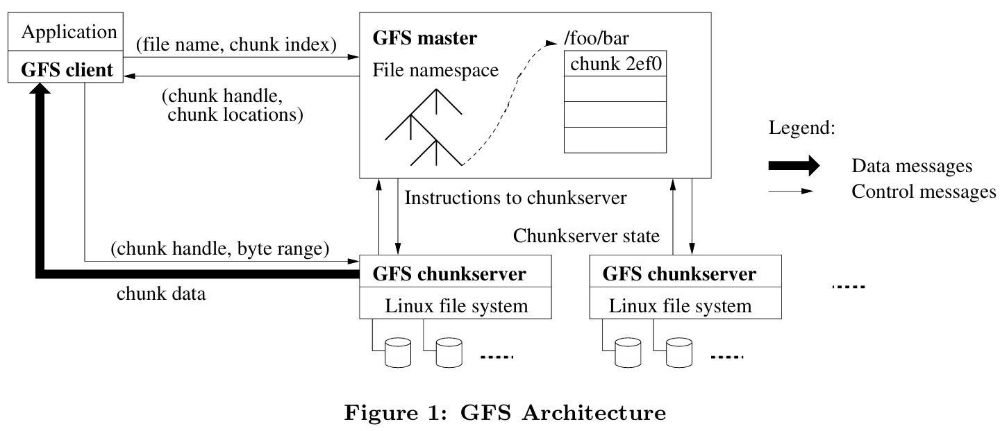
        
        - **Single master**

            **Shadow masters** provide read-only access with slightly stale metadata by replicating the primary's operation log, ensuring availability during primary failure.

            GFS prevents master **overload** by minimizing its involvement: data never passes through it, large chunks reduce metadata ops, and chunk leases delegate write coordination authority to primary replicas.

            <table>
            <thead>
                <tr>
                <th width="25%">Category</th>
                <th width="25%">Responsibility</th>
                <th>Description</th>
                </tr>
            </thead>
            <tbody>
                <tr>
                <td rowspan="4" style="vertical-align: top;"><strong>Regular Management</strong></td>
                <td><strong>Metadata Storage</strong></td>
                <td>Stores namespaces, file-to-chunk mappings, chunk locations in memory.</td>
                </tr>
                <tr>
                <td><strong>Namespace Locking</strong></td>
                <td>Locks directory operations to handle concurrent accesses.</td>
                </tr>
                <tr>
                <td><strong>Periodic Communication</strong></td>
                <td>Heartbeats with chunkservers to monitor health and exchange state.</td>
                </tr>
                <tr>
                <td><strong>Chunk Lifecycle</strong></td>
                <td>Creates chunks (rack-aware); re-replicates when replicas low; rebalances load/space.</td>
                </tr>
                <tr>
                <td rowspan="2" style="vertical-align: top;"><strong>Background Cleanup</strong></td>
                <td><strong>Garbage Collection</strong></td>
                <td>Logs deletion, renames files as hidden, lazily reclaims space.</td>
                </tr>
                <tr>
                <td><strong>Stale Replica Deletion</strong></td>
                <td>Uses version numbers to detect and remove outdated replicas.</td>
                </tr>
            </tbody>
            </table>
        
        - **Metadata**
            
            - file and chunk namespaces
            - mappings from files to chunks (unique ID)
            - locations of each chunk’s replicas (ask for chunkserver)

        - **Chunkserver** Chunkservers store 64MB chunks locally with version numbers and checksums while clients read/write via chunk handle and byte range from master without data caching.
        - **Client** GFS client sends control requests to master, caches metadata, but transfers data directly to/from chunkservers without caching file data.

    - **File read and write**

        - **Read** Client asks master for chunk locations, then reads data directly from the nearest chunkserver and returns it to the application (choose one to read).
        - **Write** Client gets locations, pushes data to all replicas' buffers, then primary serializes writes and coordinates secondaries before acknowledging (write all primary and secondaries).

    - **Fault Tolerance**

        GFS uses heartbeats to detect failures, reduces replica counts, and re-replicates chunks elsewhere to restore full replication.


#### GFS/HDFS vs. Dynamo

| Aspect | GFS / HDFS | Dynamo |
|:--|:--|:--|
| Interface | File system | Key-value store |
| Assumptions | Large files, write-once (sequential) read-many | Small object storage, random write & read |
| Primary Targets | Batch processing, high throughput, fault tolerance at scale | Transactional workloads, data availability & low latency response, conflict resolution |
| Design Choices | Master-worker architecture, cross-rack replication, relaxed consistency | Peer-to-peer architecture, consistent hashing, eventual consistency |

#### Time in Distributed Systems

- **Cristian Algorithm**

    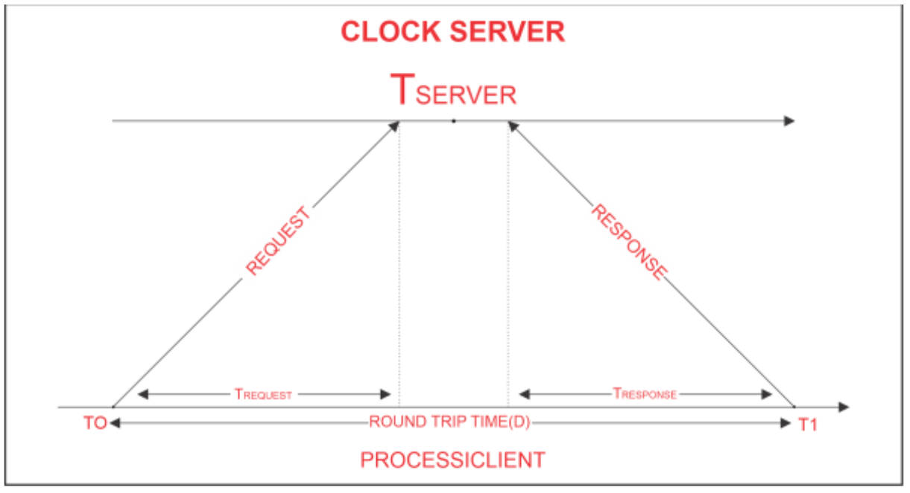

    $T_{client} = T_{server} + \frac{T_1 - T_0}{2}$

- **The Lamport Clock Algorithm**

    Lamport clocks ignore physical time and only capture the happens-before relationship between events.

    Each process $P_i$ maintains a local clock $C_i$. For a local event, $C_i \leftarrow C_i + 1$, then $C_{event} = C_i$. When process $P_i$ sending an message $k$, set $C_k = C_i$. When process $P_j$ receives an message $k$, $C_j \leftarrow \max (c_j,c_k) + 1$.

    If $a \to b$, then $T_a < T_b$. However, the converse does not hold — Lamport timestamps alone cannot be used to infer causal relationships between events.

- **Totally-Ordered Multicast**

    Totally-ordered multicast ensures identical processing order. Replicas sort queues by timestamps (dynamically updating the head), broadcast ACKs strictly for this **head**, and execute it once globally acknowledged.

- **Vector clock**

    Initially all vectors are $[0,0,\cdots,0]$.

    For each local event on process $i$, increment local entry $c_i$.

    If process $j$ receives message with vector $[d_1,d_2,\cdots, d_n]$, then $c_k = \max (c_k,d_k)$, and increment local entry $c_j$.

|Comparison|Lamport Clock|Vector Clock|
|:--:|:--:|:--:|
|Given|$C(a) < C(z)$|$V(a) < V(z)$|
|Conclusion|Either $a \to z$ or $a \parallel z$|$a \to z$|
|Precision|Cannot distinguish causality from concurrency|Precisely captures happens-before relation|

#### Parallelism Basics and Collective Communication

- **Communication patterns**
    - Point-to-point communication
    - Collective communication

- **Model**

    - **Cost of Communication** $\alpha + n \beta$ (or $\alpha + Mn \beta$ if a message encounters a link that simulaneously accommodates $M$ messages) ($\alpha$ Latency, $\beta$ Transfer time per byte, $n$ Message size in bytes, $\gamma$ Computation time per byte for reduction operations)
    - **Primitive**
        | Primitive | Pattern | Description |
        |-----------|---------|-------------|
        | Broadcast | One-to-all | One process sends the same data to all processes |
        | Reduce(-to-one) | All-to-one | All processes perform a reduction operation (sum, max, etc.) and send the result to one process |
        | Scatter | One-to-all | One process distributes distinct data chunks to all processes |
        | Gather | All-to-one | All processes send their data to a single process |
        | Allgather | All-to-all | All processes collect data from all processes (each process gets the full data set) |
        | Reduce-scatter | All-to-all | Perform local reduction first, then scatter results (first half of Allreduce) |
        | Allreduce | All-to-all | All processes perform a reduction operation, and the result is distributed to all processes |
    
- **Minimum Spanning Tree Algorithm** (emphasize low latency for small message)

    Recursive halving broadcast splits nodes in half sends to opposite half recurses achieving $\log N$ rounds optimizing latency for small messages. 
    
    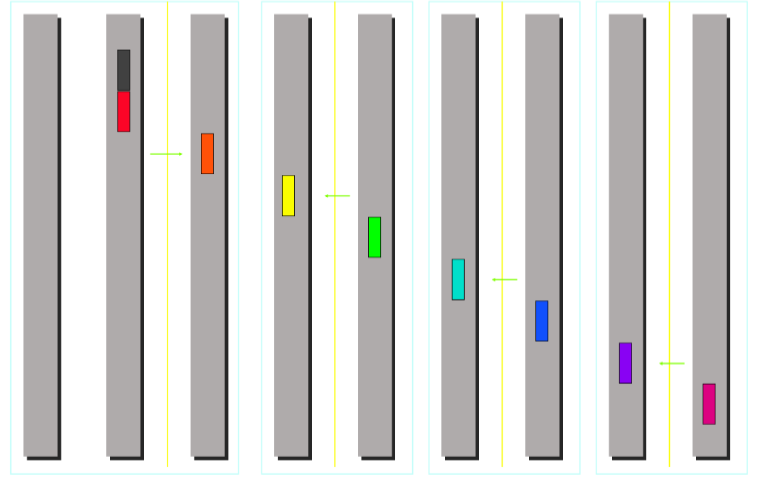

    Totoal cost:
    - **Broadcast** $\lceil \log p \rceil (\alpha + n \beta)$
    - **Reduce** $\lceil \log p \rceil (\alpha + n \beta + n \gamma)$ Compute overhead is required for reduce.
    - **scatter/Gather** $\sum \limits_{k = 1}^{\log p} \alpha + \frac{n}{2^k}\beta = \alpha \log p + \frac{p - 1}{p}n \beta$

    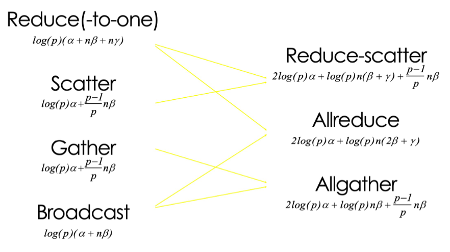

- **Ring Algorithm** (emphasize bandwidth utilization for large message)

    The bandwidth term $n \beta$ now dominates.
    
    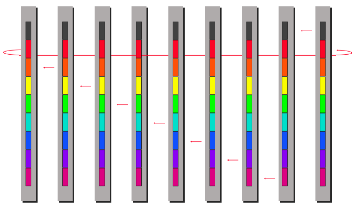

    Ring algorithm can not be better for Scatter and Gather.
    
    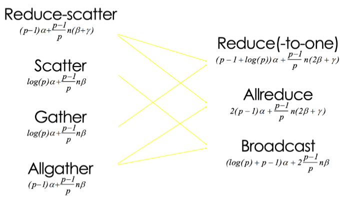
