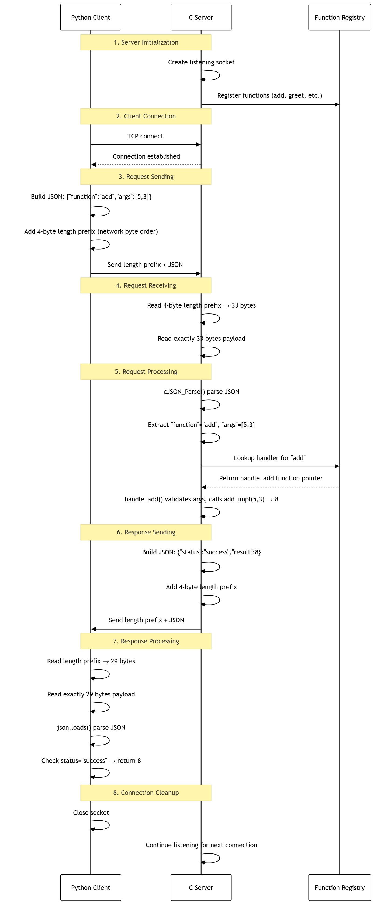

### The understanding of the JSON RPC system design

#### Overall

The client packages function name and arguments into JSON, adds a length prefix, and sends via TCP. The server receives, parses the request, looks up the function in the registry, executes it, and returns the result as JSON.

#### Detail

1. Server Initialization

    Server creates listening socket, binds to port, and registers functions with their handlers. Each function name and handler pointer is stored in the registry array for later lookup. The server then enters an accept loop, waiting for incoming client connections.

2. Client Connection

    The client creates a TCP socket and connects to the server's address and port. A connection object is used to track the socket state, enabling reliable bidirectional communication for RPC calls.

3. Request Sending

    Client builds JSON request with function name and arguments, adds **4-byte length prefix** (ensure server knows the exact mesage length), and then sends both of them.

4. Request Receiving

    Server reads 4-byte length prefix first, then reads exact number of bytes. Connection layer handles partial receives, retrying until complete message is received.

5. Request Processing

    Server parses JSON, extracts function name and arguments, looks up handler in registry, and executes the function with the provided arguments.

6. Response Sending

    The server constructs a JSON response containing a status field (`success` or `error`) and the result (or error message), prepends a length prefix, and sends the response back to the client.

7. Response Processing

    Client reads length prefix and response data, parses JSON, checks status. If the status is `success`, the result is returned; otherwise, an appropriate exception is raised.


8. Connection Cleanup

    Client disconnects, closing socket and freeing resources. Server continues listening for new connections.

#### Example

<details><summary> Click to show </summary>


</details>

### Benchmark results

```
🔍 Starting RPC Performance Benchmark
===============================

=== Paper-Inspired Performance Test ===
Table: Performance Results for Different Argument/Result Combinations
======================================================================
Test Case                 Min (ms)   Median (ms) Avg (ms)   Max (ms)
----------------------------------------------------------------------
No args/results           0.06       0.07       0.07       0.12
1 arg/result              0.03       0.04       0.04       0.06
2 args/1 result           0.03       0.03       0.04       0.09
4-byte payload            0.03       0.04       0.04       0.06
40-byte payload           0.03       0.04       0.07       0.49
100-byte payload          0.03       0.04       0.04       0.10
1000-byte payload         0.04       0.04       0.04       0.13
1 word array              0.03       0.03       0.04       0.08
4 word array              0.03       0.04       0.04       0.10
10 word array             0.04       0.04       0.05       0.11
40 word array             0.04       0.04       0.05       0.08
100 word array            0.05       0.06       0.07       0.17

Transmission Overhead Estimation:
Estimated local call time: 0.000 ms

=== Data Size Scaling Test ===

Size (bytes)    Min (ms)        Median (ms)     Max (ms)
------------------------------------------------------------
10              0.03            0.04            0.07
100             0.03            0.04            0.12
500             0.03            0.04            0.10
1000            0.04            0.06            0.07
5000            0.07            0.07            0.09
10000           0.08            0.08            0.11
50000           0.35            0.38            0.47
100000          0.59            0.64            0.67
500000          2.87            3.60            3.83
1000000         6.02            6.38            8.05

=== Throughput Test ===
Performing rapid successive calls to measure throughput...

Small Payload (add) Results:
Completed 1000/1000 calls successfully in 0.04 seconds
Throughput: 24011.08 calls/second

Medium Payload (1KB echo) Results:
Completed 500/500 calls successfully in 0.02 seconds
Throughput: 21865.60 calls/second

✅ All benchmark tests completed!
```