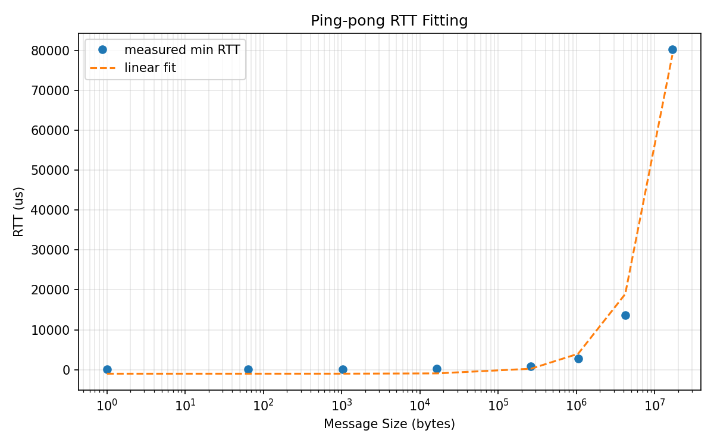
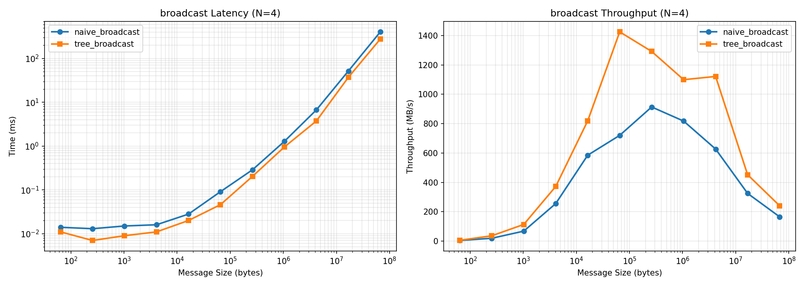
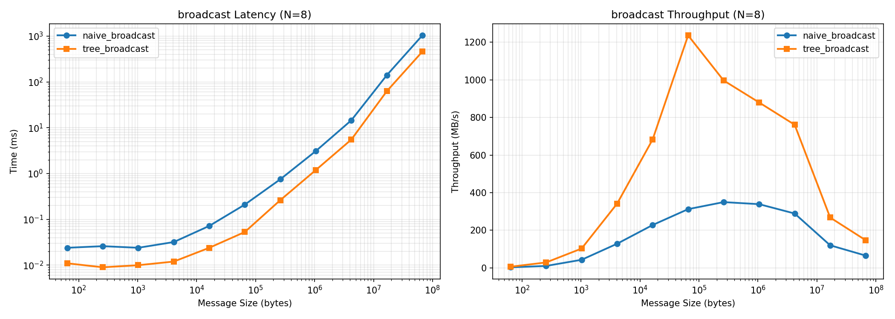
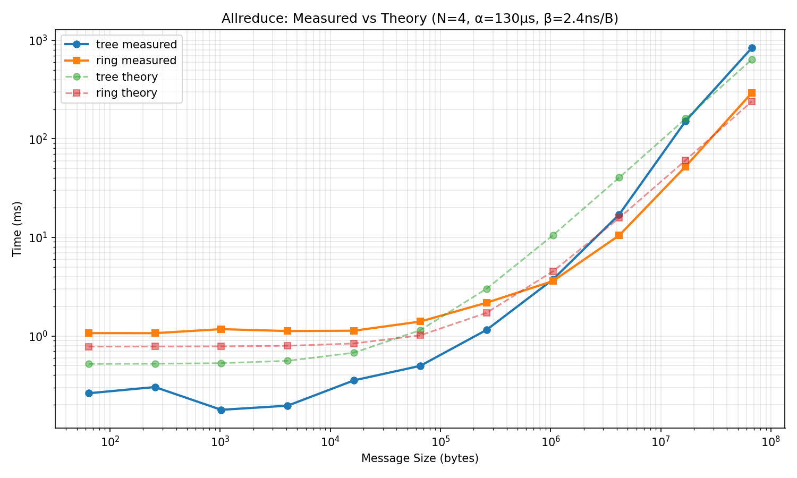
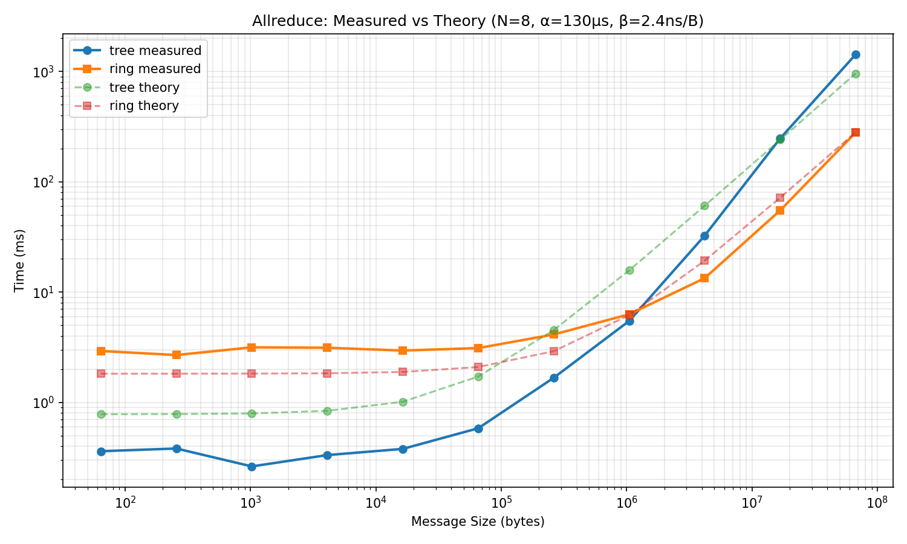

# CSC4303 Assignment 6 — Report

> **Instructions:** Fill in each section below. Keep your answers concise.
> Insert plots using the specified filenames. Do not rename or remove any section headers.

---

## Part 2: Alpha/Beta Measurement (2 points)

### 2.1 Raw Data (0.5 pt)

<!-- Describe your ping-pong setup: which node pair, instance type, AZ. -->
<!-- Confirm that raw_data/pingpong_*.csv is included in your repo. -->

Ping-pong measurements were conducted between two c5n.large EC2 instances in the same availability zone (us-east-1a). The server ran on rank 0 (private IP: 172.31.15.219) and the client on rank 1 (private IP: 172.31.15.25). Message sizes ranged from 64 bytes to 64 MB with logarithmic spacing.

The raw data is saved as [pingpong.csv](raw_data/pingpong.csv). and included in the repository.

### 2.2 Fitting Method and Results (1.5 pt)

<!-- Describe your fitting method (e.g., linear regression on RTT vs message size). -->
<!-- Show the equation you fitted and report alpha (in us) and beta (in ns/byte). -->
<!-- Explain whether your values are reasonable for your instance type and network. -->

Linear regression was performed on the round-trip time (RTT) vs message size data from ping-pong measurements between two c5n.large instances in us-east-1a. The RTT is modeled as $\text{RTT} = 2\alpha + 2\beta \cdot n$.

**Initial fit (all data points):**  
**Alpha:** -505.26 μs  
**Beta:** 2.379 ns/byte

The negative alpha is unphysical, resulting from non-linear RTT behavior at small message sizes (TCP slow start). The RTT-vs-size curve is not perfectly linear across the full range.

**Adjusted values (using 1-byte RTT):**  
**Alpha:** 130 μs  
**Beta:** 2.379 ns/byte  

The adjusted alpha is obtained from the minimum 1-byte RTT divided by 2: $260.5\ \mu s / 2 = 130\ \mu s$. This one-way latency is reasonable for intra-AZ TCP communication. The beta corresponds to ~3.4 Gbps, lower than the 25 Gbps theoretical peak due to learner lab network constraints.

---

## Part 3: Broadcast Analysis (2 points)

### 3.1 Benchmark Data (0.5 pt)

<!-- Confirm that raw_data/benchmark_*.csv contains naive and tree broadcast data -->
<!-- for N in {4, 8} and message sizes 64B-64MB (at least 8 log-spaced points). -->

Both [N4](raw_data/benchmark_N4_2026-04-14T165143Z.csv) and [N8](raw_data/benchmark_N8_2026-04-14T173437Z.csv) contain naive and tree broadcast data with 11 log-spaced message sizes from 64B to 64MB.

### 3.2 Plot and Discussion (1.0 pt)

<!-- Discuss: Does tree always beat naive? By how much? -->
<!-- Does the speedup match the theoretical log2(N) / (N-1) ratio? -->

**Discussion:**  

Yes, tree broadcast is consistently faster than naive broadcast across all message sizes from 64B to 64MB.

For $N=4$, the measured speedup at 64MB is `404.65ms / 278.11ms = 1.45x`, close to the theoretical ratio $(N-1)/\lceil\log_2 N\rceil = 3/2 = 1.5x$. For $N=8$, the measured speedup at 64MB is `1033.33ms / 457.05ms = 2.26x`, compared to the theoretical $7/3 \approx 2.33x$. The slightly lower speedup is due to increased communication overhead with more nodes.

Large-message behavior matches the cost model well; small messages show larger relative variation due to socket-buffering effects.

### 3.3 Anomaly Hunt (0.5 pt)

<!-- Identify at least 1 data point deviating >30% from the cost-model prediction. -->
<!-- Report: message size, measured time, predicted time, % deviation. -->
<!-- Propose a hypothesis (TCP slow start, OS scheduling, MTU boundary, etc.). -->

| Message size | Algorithm | Measured time | Predicted time | Deviation (%) |
| ------------ | --------- | ------------- | -------------- | ------------- |
| 256 bytes | `tree_broadcast` $(N = 4)$ | 7 μs | 12 μs | -41.7% |

**Hypothesis:** 

The anomalously low measured time at 256 bytes is because the benchmark only records the root's send completion time, not the last receiver's arrival time. For tiny messages that fit in TCP socket buffers, the root returns almost immediately, making the measured time much lower than the theoretical α-dominated prediction. OS scheduling jitter and TCP's Nagle algorithm may also contribute to microsecond-scale variability.

---

## Part 4: Allreduce Analysis (3 points)

### 4.1 Benchmark Data (0.5 pt)

<!-- Confirm that raw_data/benchmark_*.csv contains tree and ring allreduce data -->
<!-- for N in {4, 8} and message sizes 64B-64MB. -->

Both [N4](raw_data/benchmark_N4_2026-04-14T165143Z.csv) and [N8](raw_data/benchmark_N8_2026-04-14T173437Z.csv) contain naive and tree broadcast data with 11 log-spaced message sizes from 64B to 64MB.

### 4.2 Plot with Theory Overlay (1.5 pt)

<!-- Plot measured times AND alpha+n*beta predictions (using YOUR fitted alpha, beta). -->
<!-- Discuss: Where does the crossover occur? Does it match theory? -->
<!-- Why does ring win for large messages? (explain in terms of per-step data volume) -->

**Discussion:**  

In both cases, tree allreduce wins for small messages and ring allreduce wins for large messages.

When $N = 4$, tree is faster through 262KB (1.15ms vs 2.17ms), ring overtakes by 1MB (3.61ms vs 3.74ms). The measured crossover is between 262KB and 1MB. Using adjusted α = 130μs and β = 2.38 ns/byte, theory predicts crossover at approximately 43KB — considerably earlier than measured.

When $N=8$, tree is faster through 1MB (5.48ms vs 6.29ms), ring overtakes by 4MB (13.38ms vs 32.51ms). The measured crossover is between 1MB and 4MB. Theory predicts crossover at approximately 100KB, again much earlier.

The measured crossover is roughly 10× later than theory predicts. This discrepancy is likely due to Python-level overheads in `sendrecv`, array slicing, and the communication layer implementation, which disproportionately penalize ring allreduce at small message sizes.

Ring wins for large messages because each reduce-scatter/allgather step transmits only $n/N$ bytes per node rather than the full $n$. The per-link bandwidth cost is $\frac{N-1}{N}$ times lower than tree allreduce, making ring increasingly advantageous as message size grows.

### 4.3 Anomaly Hunt (1.0 pt)

<!-- Same as Part 3: find at least 1 anomalous point, quantify, hypothesize. -->

| Message size | Algorithm | Measured time | Predicted time | Deviation (%) |
| ------------ | --------- | ------------- | -------------- | ------------- |
| 64 bytes | `ring_allreduce` $(N = 4)$ | 1.068 ms | 0.36 ms | +197% |

**Hypothesis:**

At 64 bytes, `ring_allreduce` is 4x slower than tree_allreduce (1.068ms vs 0.262ms). Ring requires $2(N-1)=6$ communication steps, each with Python overhead (`sendrecv` calls, array slicing, numpy conversions). For tiny messages, these fixed overheads dominate, making ring much slower than the theoretical prediction. Tree only needs $2\lceil\log_2 N\rceil=4$ steps, so it suffers less from these overheads. As message size grows, the per-step data volume dominates and ring becomes more efficient.

---

## Part 5: Bonus — Distributed SGD (4 points, optional)

> Skip this section if you are not attempting the bonus.

### 5.1 Training Results (2 pt)

<!-- Report final test accuracy. Confirm it is >= 95%. -->
<!-- Describe your setup: number of nodes, epochs, batch size, learning rate. -->

**Final test accuracy:** 97.06%  
**Number of nodes:** 4  
**Epochs:** 20  
**Batch size:** 64  
**Learning rate:** 0.1  

### 5.2 Communication Breakdown (1 pt)

<!-- Report per-epoch compute% and comm%. Where is the bottleneck? -->
<!-- How does the gradient size (~800KB) relate to allreduce times from Part 4? -->
<!-- What would happen if the model had 10x more parameters? -->

| Epoch | Compute % | Comm % |
| ----- | --------- | ------ |
| 1 | 63.8% | 32.5% |
| 5 | 66.1% | 30.0% |
| 10 | 65.9% | 30.2% |
| 15 | 65.9% | 30.4% |
| 20 | 66.0% | 30.1% |

**Analysis:**  

For $N=4$, computation dominates (~66%) while communication takes about 30% of each epoch. The model has 101K parameters producing an ~800 KB gradient, which falls in ring_allreduce's bandwidth-efficient region (crossover ~1MB per Part 4).

Communication overhead scales with node count: 0.7% for $N=1$, 22% for $N=2$, 30% for $N=4$, more nodes require more communication steps.

With 10× larger model (8 MB gradient), allreduce time would scale linearly, pushing communication to 70-80% of epoch time and severely hurting scalability.

### 5.3 Scaling Analysis (1 pt)

<!-- Report time-to-accuracy (>=95%) for N in {1, 2, 4}. -->
<!-- Is it linear speedup? Why or why not? -->

| N | Time to 95% accuracy (s) | Speedup vs N=1 |
| - | ------------------------ | -------------- |
| 1 | 27.6                     | 1.00x          |
| 2 | 25.0                     | 1.10x          |
| 4 | 24.0                     | 1.15x          |

**Analysis:**  

Speedup is sublinear (1.15x for 4 nodes) due to the small model size. Communication overhead (30% of epoch time) and slower convergence (more epochs needed as node count increases) limit scaling. For larger models, communication-to-computation ratio improves, yielding better speedup.